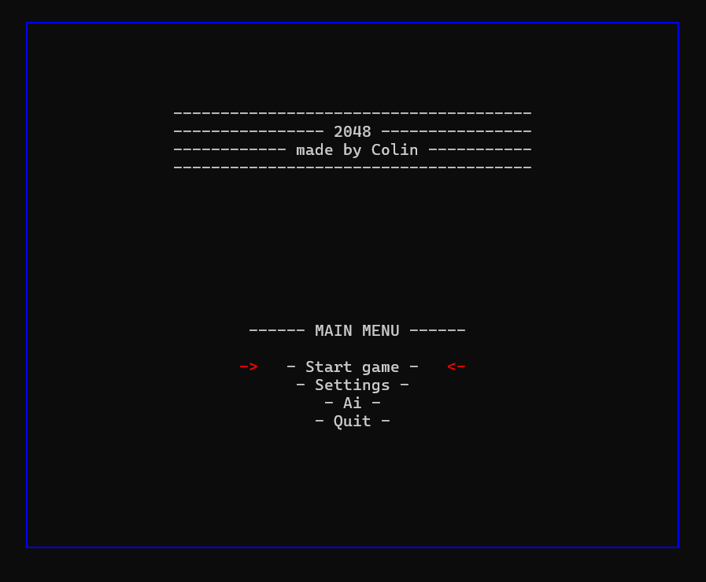
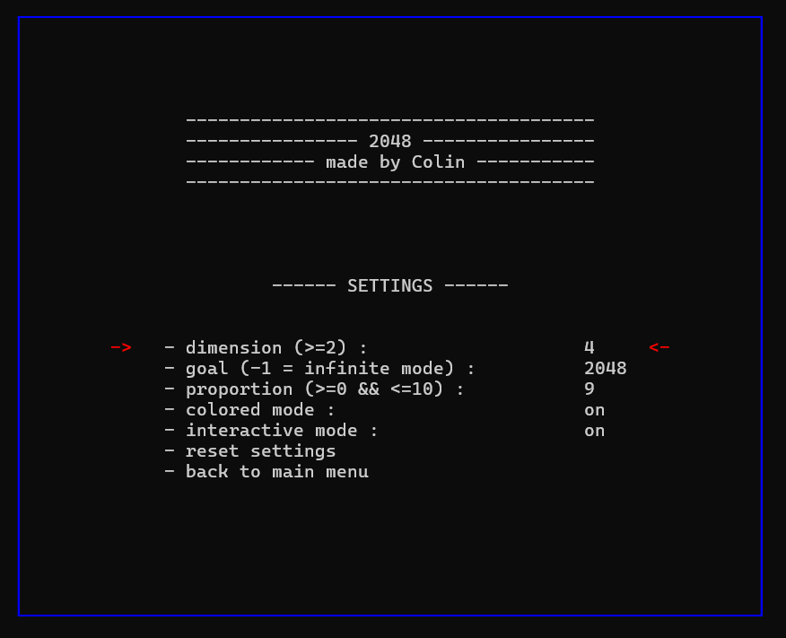
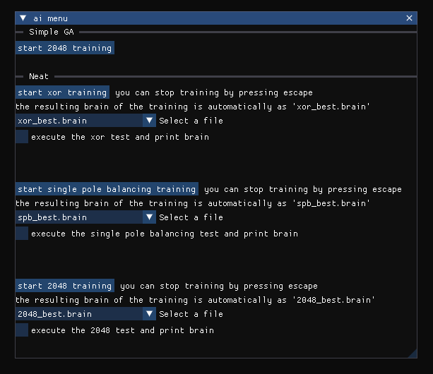

*(Project made in early 2024)*

# 2048

Une implémentation du jeu 2048 en C++.

## Description

Ce projet consiste à implémenter le jeu 2048 en C++ dans la console. Le jeu 2048 est un puzzle dans lequel le joueur combine des tuiles numérotées dans le but d'atteindre la tuile 2048. Cette implémentation nécessite la mise en place de plusieurs fonctionnalités clé, notamment la gestion des mouvements des tuiles, la fusion des tuiles identiques, la vérification des conditions de victoire et de défaite, ainsi que l'affichage du tableau de jeu à chaque étape.

L'objectif principal de mon projet est de concevoir une version du jeu déjà fonctionnelle mais aussi interactive, visuellement attirante malgré le fait de travailler dans la console et offrant une expérience utilisateur fluide et intuitive.

L'objectif secondaire de ce projet est d'implémenter deux algorithmes d'intelligence artificielle génétique et de leur apprendre à jouer au 2048. Je détaillerais cet objectif dans la section <a href="#ia">IA</a>.

## Installation et lancement du jeu

/!\ Ce projet fonctionne uniquement sous Windows  10/11, nécessite C++17 ou une version supérieure et nécessite gcc 8 ou une version supérieure.

Le projet est divisé en deux sous-projets, un sans la partie IA et un avec (ils sont respectivement nommé *without ai* et *with ai*). Celui sans la partie IA est beaucoup plus rapide à compiler. 

Un fichier *makefile* est présent dans les deux sous-projets pour simplifier l'installation. Pour lancer la compilation écrivez `make` dans un terminal après avoir navigué jusqu'au dossier avec le *makefile*. Un exécutable appelé  *2048.exe* sera créé dans le dossier *build*.</br>
Après avoir lancé l'exécutable une console devrait s'ouvrir avec le menu principal affiché comme ceci :</br>




## Main menu

- Start game : lance la partie (sans IA, c'est l'utilisateur qui joue)
- Settings : entre dans le menu des paramètres)
- Ai : lance le menu permettant de gerer l'IA, ce menu cera détailler a la fin de la section [IA](#ia).
- Quit : quitte le programme


## Les differents paramètres du jeu

Le menu *settings* devrait ressembler à cela :
</br>





- **dimension** :</br>
Dimension de la grille du 2048 (doit être supérieur à 2).

- **goal** :</br>
La tuile que vous visez comme objectif (généralement 2048). Si vous atteignez cette tuile alors vous avez gagné. Si vous voulez jouer jusqu'à l'échec (infinite mode) vous pouvez mettre *-1* comme objectif.

- **proportion** :</br>
La proportion (/10) d'apparition des tuiles 2 par rapport aux tuiles 4 (dans le jeux de base c'est 9/10).

- **colored mode** :</br>
	Active les couleurs pour le jeu et les menus.
    
- **interactive mode** : </br>
	Il y a 2 modes d'interaction possibles pour tous les menus et le jeu.
  - Le mode interactif : on peut se déplacer dans les menus ou durant une partie grâce aux flèches directionnelles du clavier et il faut appuyer sur la touche *enter* pour valider. On peut à tout moment appuyer sur la touche *escape* pour revenir au menu principal (ou pour quitter le programme si on se trouve déjà dans le menu principal). 
  - Le mode non-interactif : contrairement au mode interactif, il faudra entrer une lettre correspondant au menu choisi (ou la direction choisie pendant une partie).

- **reset settings** :</br>
Remet les paramètres par défaut.


## IA

J'ai donc tout d'abord essayé d'implémenter une version que j'ai inventée reprenant les principes d'un algorithme d'évolution génétique avec des topologies fixes (cet algorithme est nommé "simpleGA" dans les dossiers du projet). Le principe de cet algorithme est le suivant :

1. Créer une population de *n* individus chacun constitué d'un réseau de neurones de taille fixe.
2. Chaque individu va jouer au 2048.
3. Les individus avec les moins bons scores sont éliminés.
4. Les meilleurs individus sont reproduits entre eux afin de créer la génération suivante (de *n* individus) puis les parents sont éliminés.
5. Chaque individu de la nouvelle génération reçoit des mutations aléatoires.
6. Recommencer à partir de l'étape 2.

Après de nombreuses tentative au cours desquels j'ai changé les paramètres de l'algorithme, cette IA n'a malheureusement pas réussi à obtenir de bons scores. Généralement, elle tombait dans un minimum local où sa technique de jeux était d'aller vers la gauche, puis vers le bas, puis vers le droit, puis vers le haut, etc.

Après cet échec je me suis renseigné si il existait des méthodes d'apprentissage qui seraient efficaces pour le problème du 2048. J'ai trouvé deux types de méthodes :
1. Des méthodes utilisant l'algorithme de *Monte-Carlo*. Pour expliquer brièvement, à chaque tour du 2048 l'IA va faire de nombreuses simulations testant plusieurs enchaînements de mouvements et va ensuite choisir le mouvement qui lui a le plus souvent apporté un bon score dans les différentes simulations. Je considère personnellement cette méthode comme n'étant pas une IA (contrairement à ce que d'autres affirment sur Internet), car de mon point de vue c'est juste un algorithme de force brute un peu optimisé.
2. Des méthodes utilisant du *reinforcement learning*. Je n'ai pas trouvé de personnes utilisant cette méthode sur le 2048 mais je connaissais déjà une méthode appelée *Proximal Policy Optimization (PPO)* qui fait partie de la branche du *reinforcement learning*. Pour expliquer très simplement, c'est une méthode où à chaque mouvement fais par l'IA on va la récompenser ou la sanctionner en fonction de son choix.

Je n'ai pourtant choisi aucune de ces méthodes. La première car je ne la considérais pas comme de l'IA. La seconde car pour son bon fonctionnement je devais définir ce qui est bien et ce qui est mal (exemple : avoir ses plus grosses tuiles dans un coin est un bon choix). Or je voulais vraiment faire une IA qui apprend d'elle-même de façon non supervisé donc sans avoir besoin de lui dire ce qui est bien et ce qui ne l'est pas.

Je suis me suis donc dirigé vers un algorithme appelé *NEAT (NeuroEvolution of Augmenting Topologies)*.</br>
Cet algorithme est aussi un algorithme d'évolution génétique, mais beaucoup plus poussé que le premier que j'ai fait.
Les deux différences les plus importentes par rapport au premier algorithme sont :
1. La topologie des réseaux de neurones n'est pas fixe, mais évolue, d'où le nom de cet algorithme : *NeuroEvolution of **Augmenting Topologies***. 
2. Cet algorithme intègre une notion d'espèce au sein d'une population d'individus.

Je ne vais pas entrer dans les détails de cet algorithme car c'est compliqué et très long mais voici un lien vers le document le présentant : [the NEAT algorithm by Kenneth O. Stanley](https://nn.cs.utexas.edu/downloads/papers/stanley.ec02.pdf)

Je pouvais utiliser l'implémentation en C++ déjà existante de cet algorithme mais ça ne m'intéressais pas donc je n'ai pas regardé cette implémentation et j'ai décidé de créer ma propre implémentation de l'algorithme en utilisant son explication donnée dans le document cité ci-dessus.

Après avoir (enfin) réussi à complètement implémenter cet algorithme, je l'ai testé sur 2 problèmes connus :
1. Le premier problème était d'apprendre à résoudre l'opération logique XOR. l'opération XOR n'étant pas linéairement séparable, cela rend ce problème approprié pour tester mon implémentation.
2. Le deuxième problème appelé *spb (single pole balancing)* consiste à maintenir en équilibre un poteau en le déplaçant latéralement sur une plateforme. Le poteau est attaché à la plateforme et il doit être maintenu droit aussi longtemps que possible.

Mon implémentation a bien réussi à résoudre ces 2 problèmes sans aucune difficulté. J'ai donc voulu pousser le problème du *spb* plus loin en positionnant le poteau vers le bas. L'IA devait ainsi apprendre tout d'abord balancer le poteau afin de le mettre à la verticale puis réussir à le maintenir. J'ai mis beaucoup de temps avant à résoudre ce problème mais j'ai finalement réussi. J'ai donc rajouter une autre difficulté, j'ai positionné le poteau à un angle aléatoire dans le but de rendre l'IA capable de balancer le poteau dans n'importe quelle situation et de réussir à le remettre à la verticale, même si une perturbation (exemple: une rafale de vent) le fait retomber. Malheureusement, jusqu'à maintenant je n'ai pas réussi à résoudre cette difficulté, l'IA réussi toujours à mettre le poteau à la verticale, mais n'arrive pas à le maintenir. Je ne sais malheureusement pas si le problème vient d'un bug dans mon implémentation que je n'ai pas réussi à voir ou si ce sont seulement les paramètres de l'IA que j'ai choisi pour ce problème qui ne sont pas les bons.

Avec cet échec sur une tâche qui me semblait quand même beaucoup plus simple que le 2048, je n'avais pas beaucoup d'espoir. 

J'ai quand même testé l'implémentation avec le 2048, et j'ai étonnamment réussi à obtenir des tuiles de 512, mais malheureusement il semble que c'était plutôt des coups de chance. L'IA à quand même l'air de mieux performer en moyenne que le premier algorithme génétique mais elle reste tout de même peu performante.


#### Description du menu IA :
Voici à quoi devrait ressembler le menu IA :



Contrairement aux autres menu ce menu n'est pas dans la console, c'est une fenêtre à part.

Le menu est divisé en 2 catégories:
- Simple GA
- Neat

Dans la catégorie *Simple GA* il y a un seul bouton appelé *start 2048 training*. Ce bouton lance l'entraînement de l'IA sur le 2048 grâce à l'algorithme *Simple GA*. Si vous cliquer sur ce bouton, 2 fenêtres vont s'ouvrir et un menu va s'afficher dans la console. Le menu dans la console permet de mettre l'entraînement en pause et de tester l'IA sur le 2048. Les 2 autres fenêtres sont respectivement, la visualisation du réseau de neurones de l'IA et un graphique montrant l'évolution du score de l'IA.</br>
Pour cet algorithme, si vous quittez l'entraînement et que vous le relancer, alors l'entraînement ne vas pas recommencer à zéro. Si vous voulez relancer l'entraînement à partir de 0, il va falloir relancer le programme.</br> Pour cette catégorie je n'ai pas eu le temps d'implémenter de sauvegarde pour le cerveaude l'IA.
</br>
</br>

La catégorie *Neat* est divisé en 3 sous-parties, une pour le test *xor*, une pour le test *spb* et la dernière pour le 2048.</br>
Dans chacune de ces 3 sous-parties il y a :
- un bouton *start training* qui permet de lancer l'entraînement du test correspondant (ce n'est pas écrit mais on peut cliquer sur '*p*' pour mettre l'entrainement en pause et '*g*' pour tester le meilleur cerveau courrant, /!\ attention dans de rares cas sur le test *spb* le fait de cliquer sur '*g*' peut faire crash le programme).
- une liste déroulante permettant de choisir un cerveau déjà entraîné pour pouvoir ensuite le visualiser et le tester.
- une case à cocher pour tester et visualiser le cerveau choisi dans la liste déroulante.

Quand on lance l'entraînement sur un test, le cerveau résultant sera automatiquement sauvegardé.</br>
J'ai déjà fourni de base 3 cerveaux pour les 3 tests.
/!\ attention ne pas tester un cerveau ne correspondant pas au test choisi, exemple : ne pas tester le cerveau *xor_test.brain* sur le test 2048 ou le test *spb*.

A la fin de chaque entraînement le programme va directement tester le cerveau résultant. Une fois le test terminé, il faudra cliquer sur *enter* pour quitter l'entraînement et revenir au menu IA. </br>
Pendant le test du 2048 il faudra cliquer sur *enter* pour que l'IA fasse une action.

Pour quitter le menu IA il faudra juste fermer la fenêtre du menu.


/!\ Attention: L'entraînement de chaque IA est un processus qui peut être très lent sur un ordinateur peut performant. Les inputs utilisés pour quitter prématurément un entraînement sont dans le même thread que l'entraînement, donc sur un ordinateur peut performant il se peut que les inputs ne soient pas pris en compte. Si vous êtes dans ce cas les deux solutions sont de cliquer plein de fois sur la touche pour quitter un entraînement ('*enter*') ou de tout simplement quitter le programme en fermant la console. </br> J'ai testé ce programme sur un i7-10750H, 6 cœurs à 2.6ghz et pour les 3 tests je n'ai jamais eu en dessous de 10 génération par seconde. J'ai aussi testé sur un i7-13700kf, 16 cœurs à environ 5ghz et je faisais au minimum 30 génération par seconde.

/!\ Attention : pour l'entraînement du 2048 au bout de quelques centaines de générations, une explosion du nombre d'espèces apparaît ce qui peut provoquer une grosse baisse de performance.

## Informations sur le code

Pour la partie sans l'IA le projet utilise uniquement ces bibliothèques :

```
bibliothèque standard :
  - cstdlib
  - time.h
  - iostream
  - vector
  - limits
  - string
  - cassert
  - iomanip
  - sstream
  - cmath

autres:
  - random
  - future //pour utiliser std::cin dans d'autre thread
  - fstream //sauvegarde d'une partie
  - filesystem
  - windows.h //manipulation de la console/input clavier
```
Pour la partie avec l'IA le projet utilise aussi ces bibliothèques:
```
  - random
  - unordered_map
  - chrono
  - thread
  - omp.h //parallèlisation
  - algorithm
  - list
  - functional
```
La partie IA utilise une interface graphique qui fonctionne grâce à une bibliothèque externe appelé ImGui (https://github.com/ocornut/imgui) et aussi grâce à une extension de cette interface permettant de créer des graphique appelé ImPlot (https://github.com/epezent/implot)</br>
J'utilise comme backend pour l'interface graphique opengl3 et glfw.

Pour simplifier l'utilisation de ImGui et de openGl j'ai créer une classe appelé GlHelper qui permet de gérer la partie grapique avec que 5 fonctions: 
- ``start()`` cette fonction doit être appelé qu'une seule fois au début du programme. Elle permet d'initialiser la partie graphique.
- ``stop()`` ou ``stopIfAllWindowsAreClosed()`` ces fonctions doivent être appelé qu'une seule fois à la fin du programme. Elles permettent de stopper la partie graphique.
- ``add()`` permet d'ajouter une fonction "d'affichage".
- ``remove()`` permet d'enlever une fonction "d'affichage".

Pour pouvoir afficher quelque chose avec cette classe il faudra créer une fonction du type :

```C++
void maFonctionAffichage(bool* p_open)
```

et il faudra ajouter cette fonction à la classe comme ceci :

```C++
GlHelper::add(&maFonctionAffichage, "ma fonction d'affichage");
```
Exemple d'un programme affichant une fenêtre appelé "hello !" avec écrit "hello world !" à l'intérieur :

```C++
#include "glHelper.h"

void maFonctionAffichage(bool* p_open)
{
    ImGui::Begin("hello !", p_open);
    ImGui::Text("hello world !");
    ImGui::End();
}
int main()
{
    GlHelper::start();

    GlHelper::add(&maFonctionAffichage, "ma fonction d'affichage");

    GlHelper::stopIfAllWindowsAreClosed();
    return 0;
}
```
Cette classe est documentée donc pour plus d'informations sur son fonctionnement vous pouvez aller voir son code dans le dossier *glHelper*.


**/!\ À part le code de la bibliothèque externe  *imgui* tout le code dans ce projet vient entièrement de moi.**

## Ce que je n'ai pas eu le temps de faire

Il y a deux choses que j'aurai aimé rajouter :
- Utiliser Cuda pour paralléliser l'entraînement des IA sur la carte graphique, possédant une RTX 4080 le gain de temps pour chaque entraînement aurait été très significatif.
- Ajouter un algorithme de *reinforcement learning*, même si comme je l'ai dit dans la section IA cet algorithme ne correspond pas trop à ce que je voulais faire de base, j'aurai quand même aimer l'implémenter.
